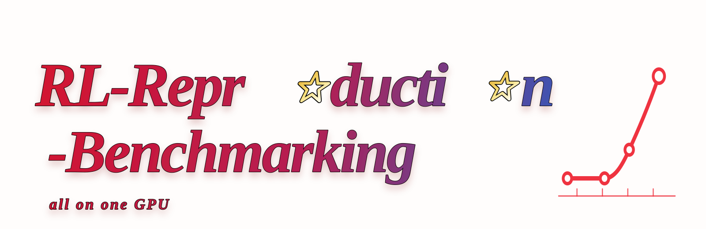

<div align="center">
  
</div>

# Reinforcement-Learning-Reproduction-and-Benchmarking

An open-source project primarily focused on **reproducing, understanding, and benchmarking modern reinforcement learning algorithms**.

The current work is organized along several complementary dimensions:

- **Action spaces:** discrete and continuous control
- **Agent settings:** single-agent and multi-agent learning
- **Learning paradigms:** model-free and model-based reinforcement learning
- **Practical focus:** academic baselines, training heuristics, reproducibility techniques, and production-oriented engineering practices

The project documents both algorithmic details and practical techniques that affect real-world performance, including exploration, replay-buffer design, normalization, reward and advantage estimation, target-network updates, entropy regularization, parallel data collection, evaluation across random seeds, and training efficiency.

Broader domain-specific coverage is a **future direction**, rather than the primary focus of the current work. Planned domains may include games, robotics, locomotion, navigation, manipulation, and general control tasks.

Representative and planned methods include **PPO, SAC, TD7, Agent57, BBF, multi-agent reinforcement learning methods, and World-Action Models**.

---

## Leaderboard: Atari-16 (Human-Normalized Score)

Human-normalized score (HNS) on the [Atari-16 suite](docs/envs/atari-16.md):
`HNS = 100% × (Agent − Random) / (Human − Random)`, with Human / Random baselines
from the Agent57 reference tables [[2]](#references). Aggregated across games as
median / mean of per-game HNS, sorted by median.

<table>
  <thead>
    <tr>
      <th align="right">#</th>
      <th>Method</th>
      <th align="right">Median HNS</th>
      <th align="right">Mean HNS</th>
      <th align="center">Games</th>
    </tr>
  </thead>
  <tbody>
    <tr>
      <td align="right">1</td>
      <td><span style="color:#8a8f98"><i>Agent57&nbsp;&#8224;</i></span></td>
      <td align="right"><span style="color:#8a8f98"><i>314.6%</i></span></td>
      <td align="right"><span style="color:#8a8f98"><i>2706.7%</i></span></td>
      <td align="center"><span style="color:#8a8f98"><i>16/16</i></span></td>
    </tr>
    <tr>
      <td align="right">2</td>
      <td><span style="color:#8a8f98"><i>PPO&nbsp;(Schulman&nbsp;et&nbsp;al.,&nbsp;2017)&nbsp;&#8224;</i></span></td>
      <td align="right"><span style="color:#8a8f98"><i>9.1%</i></span></td>
      <td align="right"><span style="color:#8a8f98"><i>32.9%</i></span></td>
      <td align="center"><span style="color:#8a8f98"><i>14/16</i></span></td>
    </tr>
    <tr>
      <td align="right">3</td>
      <td><b>PPO_SB3 (this repo)</b></td>
      <td align="right"><b>3.7%</b></td>
      <td align="right"><b>16.6%</b></td>
      <td align="center">16/16</td>
    </tr>
  </tbody>
</table>

**†** *Gray italic* entries are literature reference scores — **no runnable source
code in this repository**. Black entries were trained, audited, and archived by this
repository.

Leaderboard notes:

- **Agent57**: per-game HNS values taken from Badia et al., Appendix H.4 [[2]](#references),
  aggregated here over the 16 games of this suite (their headline 57-game result is higher).
- **PPO (paper)**: mean final score of the last 100 training episodes, 3 seeds, 40M game
  frames per run, converted to HNS [[1]](#references). The paper omits skiing and solaris,
  so the aggregate covers the remaining 14 games.
- **PPO_SB3**: this repository's run — 10M agent steps per game, single seed 0, final
  checkpoint audited over 30 deterministic episodes on fixed seeds (20000–20029),
  unclipped raw returns. Per-game HNS uses the audit mean.
- The three rows are **cross-protocol reference values**, not a strict same-protocol
  ranking: they differ in environment stack (2017 ALE vs Gymnasium/ALE-Py), stochasticity,
  action sets, budget accounting, and score definitions. Per-game raw scores, HNS, and
  protocol caveats: [full report](docs/reports/ppo-experiments.md#2-ppo-paper-vs-pposb3-on-atari-10-hns).

Headline findings from the first campaign (PPO on Atari-16, 16/16 completed):

- 10M-step PPO **exceeds the human baseline on enduro (111.4% HNS)** and is near it on
  gopher (108.6%), but **fails to explore** the six mandatory hard-exploration games
  (montezuma_revenge, pitfall, venture, solaris at 0; skiing at −100.9%; private_eye at −4.3%).
- Against the PPO paper under equal 10M-step budget, PPO_SB3 wins on frostbite (7.95x HNS),
  seaquest (1.48x), and enduro (1.26x), and reaches 0.41x–0.88x of the paper elsewhere
  ([per-game table](docs/reports/ppo-experiments.md#2-ppo-paper-vs-pposb3-on-atari-10-hns)).

## Documentation

```text
.
├── docs/
│   ├── envs/
│   │   └── atari-16.md          # Benchmark suite: selection logic, game list, env stack, score provenance
│   ├── reports/
│   │   └── ppo-experiments.md   # PPO campaign: configurations, results, protocol notes
│   └── icon.svg
├── LICENSE                      # Apache-2.0
└── README.md
```

- **[docs/envs/atari-16.md](docs/envs/atari-16.md)** — the Atari-16 environment suite:
  why these 16 games (skill coverage + the six MuZero-below-human games [[3]](#references)),
  the fixed game order, the unified `ALE/<Game>-v5` environment contract, and where
  reference scores come from.
- **[docs/reports/ppo-experiments.md](docs/reports/ppo-experiments.md)** — experiment
  report: PPOSB3 (Stable-Baselines3 PPO, Atari-tuned) and a PPO-PyTorch reference
  backend with upstream CartPole semantics; unified configurations, run results,
  completion status, and cross-backend protocol notes.

## Methodology in Brief

- **Budget accounting:** one policy action decision = 1 step; 10M steps ≈ 40M raw ALE
  frames per game.
- **Environment:** Gymnasium 1.2.2 / ALE-Py 0.12.1, `ALE/<Game>-v5` minimal action sets,
  noop 30, frame skip 4, grayscale 84×84, stack 4, sticky actions off, 108k-frame
  episode cap; training rewards sign-clipped, evaluation unclipped.
- **Scoring:** the primary score is always the **final** checkpoint's mean raw return
  over 30 deterministic episodes on fixed seeds — best-checkpoint scores are used only
  for selection and videos, never as the headline number.
- **Provenance:** per-run configs, ROM SHA256s, checkpoint hashes, per-episode scores,
  and hardware/pip-freeze snapshots are archived with every campaign.

Algorithm source code and run artifacts are being migrated from the internal research
workspace and will land in this repository progressively.

## References

1. J. Schulman, F. Wolski, P. Dhariwal, A. Radford, O. Klimov. *Proximal Policy
   Optimization Algorithms.* arXiv:1707.06347, 2017. https://arxiv.org/abs/1707.06347
2. C. Badia et al. *Agent57: Outperforming the Atari Human Benchmark.*
   arXiv:2003.13350, 2020. https://arxiv.org/abs/2003.13350
3. J. Schrittwieser et al. *Mastering Atari, Go, Chess and Shogi by Planning with a
   Learned Model.* arXiv:1911.08265, 2019. https://arxiv.org/abs/1911.08265
4. A. Raffin, A. Hill, A. Gleave, A. Kanervisto, M. Ernestus, N. Dormann. *Stable-Baselines3:
   Reliable Reinforcement Learning Implementations.* JMLR 22(268), 2021.
   https://jmlr.org/papers/v22/20-1364.html
5. M. Towers et al. *Gymnasium: A Standard Interface for Reinforcement Learning
   Environments.* arXiv:2407.17032, 2024. https://arxiv.org/abs/2407.17032
6. N. Barhate. *PPO-PyTorch: Minimal PyTorch implementation of PPO.*
   https://github.com/nikhilbarhate99/PPO-PyTorch (MIT).

## License

This repository is released under the [Apache License 2.0](LICENSE).
